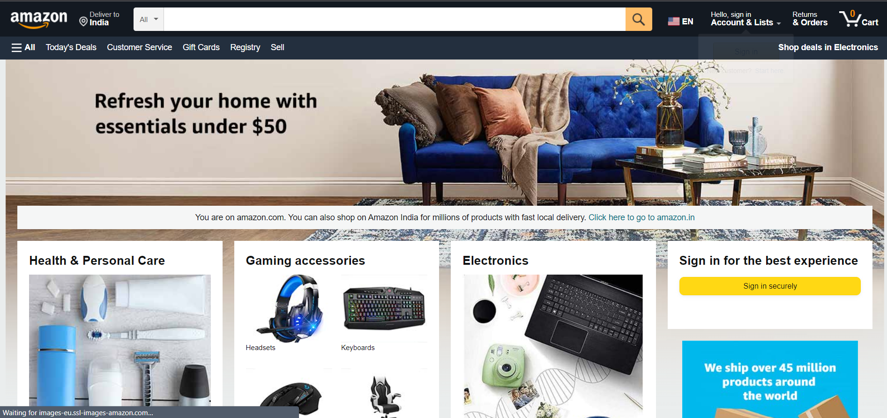
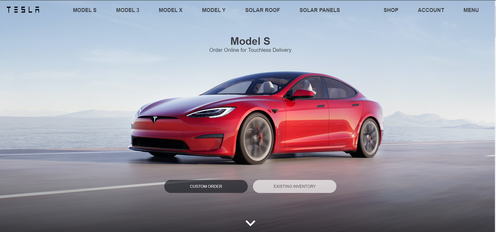

# Amazon and Tesla Clone

Front-End Website Clones of popular website [Amazon](https://www.amazon.in/) and [Tesla](https://www.tesla.com/) using React JS


## 🖥️ Tech Stack

- HTML
- CSS
- ReactJs, Redux
- NodeJS
- Stripe

## 🪶 Features

- Visual assets have been used to replicate the original website to the maximum
- Cart value update with buy now option in amazon website
- React Redux for trigerring action for various use cases
- Use of animations to replicate original website
- Stripe used for making dummy payment gateway

## 📺 Visuals

- ## Amazon Website Clone


- ## Tesla Website Clone



## ⚙️ Installation Instruction


Clone the repo
 ```
https://github.com/Kushagra20075/ReactJs.git
 ```

Navigate into any repository and enter
 ```
npm install
npm start
 ```